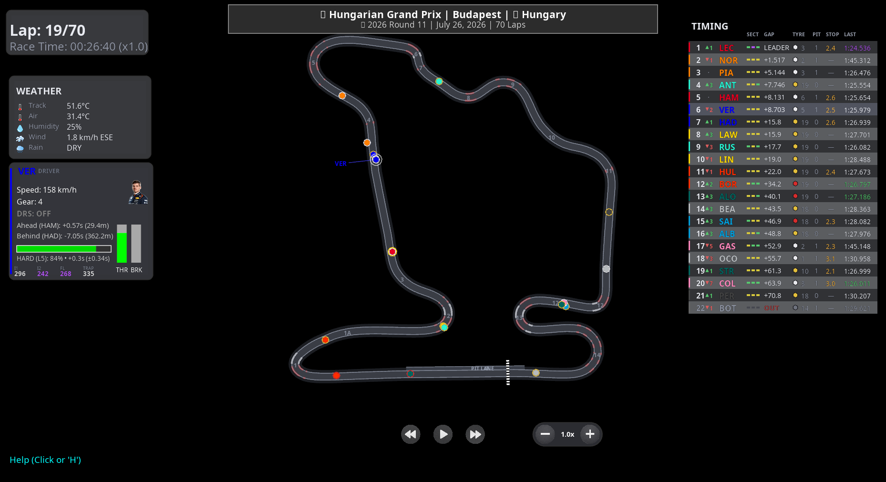
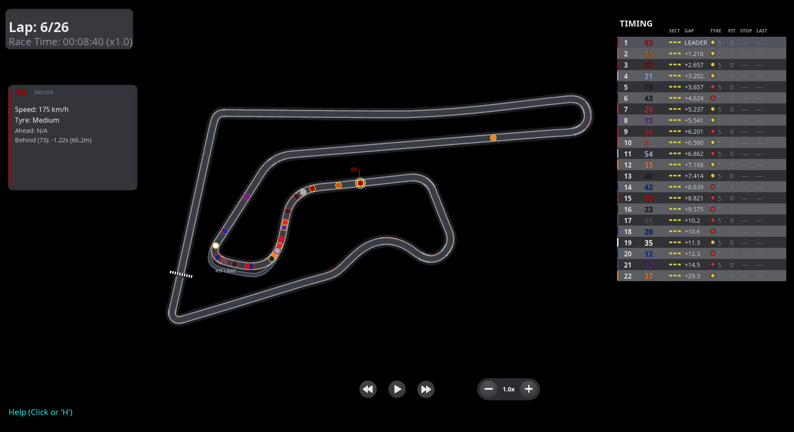

# Pitwall 🏁

**Your own pit wall for motorsport.** Watch a session live as it happens, or
replay a past one — every rider on track, a running leaderboard, tyres, gaps
and full telemetry, all in one window.

**Formula 1 and MotoGP are both supported today** (MotoGP includes Moto2 and
Moto3). Pick your series in the menu, or launch one straight from the command
line.

| Formula 1 | MotoGP |
|-----------|--------|
|  |  |
| Click any car for its portrait, live telemetry, tyre condition and speed-trap bests. | Click any bike for its speed, tyre compound and gaps — the panel adapts to what each series publishes. |

```bash
python main.py                 # pick any series and session from the GUI
python main.py --live          # follow the F1 session running right now
python main.py --motogp-live   # follow the MotoGP session running right now
```

> **🔴 Live Mode** puts cars on track within a couple of seconds of the real
> thing — for F1, usually *ahead* of the TV broadcast. See [docs/LiveMode.md](./docs/LiveMode.md).

> **📡 Telemetry stream** broadcasts every frame over a local socket so you can
> build your own dashboards alongside the replay. See [telemetry.md](./telemetry.md).

## Supported series

| Series | Live | Replay | Sessions | Positions from |
|--------|:----:|:------:|----------|----------------|
| **Formula 1** | ✅ | ✅ | Race, Sprint, Qualifying, Practice 1–3 | GPS position feed (FastF1) |
| **MotoGP / Moto2 / Moto3** | ✅ | ✅ | Race, Sprint | Reconstructed from official sector times |

Both series share the same window: circuit view, timing tower, rider detail
panel, live mode and the telemetry stream. The **rider detail panel adapts to
each series** — Formula 1 shows gear, DRS, throttle and brake; MotoGP shows the
tyre compound, since bikes publish no such telemetry.

## Features

### On track

- **Circuit view.** The track drawn as a racing surface — asphalt, kerbs on the
  corners, a runoff apron, the pit lane and the start/finish line. F1 circuits
  come from FastF1 with numbered corners; MotoGP circuits are built from the
  official circuit SVG, scaled to the real lap length, with the pit lane and
  start/finish line lifted from the same drawing.
- **Cars and bikes.** Each carries its team colour, a tyre-compound ring, a
  leader marker and (F1) a DRS glow. Click one — on track or in the tower — to
  follow it; shift-click to compare several.
- **Safety car (F1).** Watch it deploy from the pit lane, lead the field and
  return, with animated transitions and a pulsing glow.

### Timing tower

- **Running order** with gaps, places gained or lost against the grid, tyre
  compound and age, pit-stop count and the real stationary time in the box.
- **Last lap** coloured purple for the session best and green for a personal
  best.
- **Sector status (F1).** Each driver's last three sectors shown purple, green
  or yellow, the way a broadcast tower does.
- **Retirements.** Riders who crash out or pull in are marked **OUT**.

### Rider detail

Selecting a car or bike opens its panel:

- **Formula 1:** portrait, speed, gear, DRS, throttle/brake bars, tyre
  condition, gaps to the cars either side, and best speed at each of the four
  measuring points on the lap (purple where it leads the session).
- **MotoGP:** speed, tyre compound, and gaps to the riders either side. Gear,
  DRS and pedal telemetry are hidden because the series does not publish them.

### Live mode

- **Follow a live session** for either series — race, sprint, qualifying or
  practice — rewind into what you missed, and jump back to live with **G**.
- **Session countdown.** Live and practice sessions show the time remaining.
- When nothing is on, the command tells you what is next and how long until it
  starts.

### Insights and analysis (F1)

Launched automatically alongside the replay, from a floating menu:

- **Race position chart** — every driver's position against lap number.
- **Gap chart** — time to the leader lap by lap, so pit stops read as steps and
  a safety car pulls every line together. Works live and on finished races.
- **Championship standings** — where the season stands, plus the feed's own
  projection of where it would stand if the race ended now.
- **Team radio** — messages on the race-control timeline, with a link that
  plays the clip.
- **Local yellows** — a flag naming a marshalling sector lights up that stretch
  of track only, so you can see which corner the incident is at.

### Sessions

- **Race and sprint** for both series.
- **Qualifying and practice (F1).** FP1–FP3 ranked the way a practice screen
  ranks them: by best lap set so far, with each driver's gap to the session
  best and their lap count, and the clock counting down to the flag.

## MotoGP

MotoGP publishes no positional feed, so a bike's place on track is
**reconstructed** from the four intermediate split times the official Analysis
sheet records for every lap — walked along the circuit centreline at the pace
those splits imply. The result is the same replay window F1 uses: every rider
on track, a live timing tower, tyre compounds and gaps.

Launch a MotoGP session from the GUI (choose **MotoGP** in the Series dropdown)
or directly:

```bash
# 2025 Thailand Grand Prix, MotoGP race
python main.py --motogp --year 2025 --event THA --class MotoGP --session RAC

# Moto2 race, or a MotoGP sprint
python main.py --motogp --year 2025 --event THA --class Moto2  --session RAC
python main.py --motogp --year 2025 --event THA --class MotoGP --session SPR

# Follow whatever MotoGP session is running now
python main.py --motogp-live
```

`--event` takes the three-letter event code (`THA`, `NED`, `ITA`, …);
`--class` is `MotoGP`, `Moto2` or `Moto3`; `--session` is `RAC` or `SPR`.

The data comes from MotoGP's public API. Timing sheets are © Dorna and are
**not** distributed with the project — the tests fetch them locally with
`tests/fixtures/motogp/download_pdfs.py`. See
[docs/MotoGPDataSources.md](./docs/MotoGPDataSources.md) for the full breakdown
of what's available and how positions are reconstructed.

## Live Mode

```bash
python main.py --live           # Formula 1
python main.py --motogp-live    # MotoGP
```

Attaches to whatever session is running right now and plays it in the replay
window with all the usual features. Press **G** at any time to jump back to the
live edge after rewinding.

When nothing is on, the F1 command tells you what is next:

```
No session is running right now. Next up: Dutch Grand Prix - Practice 1
in 25h 48m (2026-08-21 10:30 UTC).
```

Want to try F1 live outside a race weekend? The simulated source replays a past
session through the same pipeline at real speed:

```bash
python main.py --live --live-source simulated \
  --live-path "2026/2026-07-26_Hungarian_Grand_Prix/2026-07-26_Race/" \
  --live-offset 4200
```

Full details, latency tuning, data sources and troubleshooting are in
[docs/LiveMode.md](./docs/LiveMode.md).

## Controls

- **Go Live (live mode only):** **G** to jump back to the newest data
- **Pause/Resume:** SPACE or Pause button
- **Rewind/Fast Forward:** ← / → or Rewind/Fast Forward buttons
- **Playback Speed:** ↑ / ↓ or Speed button (cycles through 0.5x, 1x, 2x, 4x)
- **Set Speed Directly:** Keys 1–4
- **Restart:** **R** to restart replay
- **Toggle DRS Zone (F1):** **D** to hide/show DRS zones
- **Toggle Progress Bar:** **B** to hide/show progress bar
- **Toggle Driver Names:** **L** to hide/show names on track
- **Select rider/riders:** Click a car on track or a row in the timing tower; shift-click to select several

## Getting started

Installation, requirements, troubleshooting and the full list of
command-line options live in **[docs/GettingStarted.md](./docs/GettingStarted.md)**.

```bash
pip install -r requirements.txt
python main.py            # then pick a series and session in the menu
```

## Accuracy and data quality

### Formula 1

F1's timing feeds are not always clean, and two problems were worth fixing
properly rather than living with.

**Leaderboard order.** The running order used to be wrong through the first few
corners, disturbed by pit stops, and scrambled at the flag. All three came from
ranking cars by projecting their coordinates onto the track, and the position
feed is not good enough for that. Ranking now uses the speed-integrated
distance channel, with the starting grid seeding lap one and the official
result taking over at the chequered flag. Measured against official timing for
the 2026 Hungarian Grand Prix:

| | Before | After |
|---|---|---|
| Exact at a line crossing | 57.6% | **98.4%** (100% within one place) |
| Worst error | 21 places | **1 place** |
| Order at lights out | 10.4 places out | **exact** |
| Final classification | 1.8 places out | **exact** |

See [src/lib/classification.py](./src/lib/classification.py).

**Lap times and gaps.** The tower's numbers come from the same lap data the
official timing uses. Checked against the 2026 Hungarian Grand Prix at four
points in the race, last lap times matched official timing exactly in all 88
comparisons, personal bests agreed in all 88, and the session best matched
both value and holder.

**Cars freezing on track.** Occasionally a session's position feed degrades and
only locates a car every two or three seconds, so cars appear to freeze and
then jump. Where that happens they are now walked along the circuit at the
speed the telemetry says they were doing; live mode additionally carries a car
forward when the feed has lost it entirely. See
[docs/LiveMode.md](./docs/LiveMode.md#when-the-position-feed-falls-behind).

> **Rebuild old replays.** Anything cached before these changes still holds the
> old ordering and unrepaired positions. Re-run it once with `--refresh-data`.

### MotoGP

Every rider's parsed lap count matches the official classification, and a
reconstructed podium matches the real result. Because there is no positional
feed, on-track placement is reconstructed from four sector splits per lap; it
is accurate to within a corner or two, not metre-perfect. The full method and
its limits are in [docs/MotoGPDataSources.md](./docs/MotoGPDataSources.md).

## Documentation

| Guide | What it covers |
|-------|----------------|
| [docs/LiveMode.md](./docs/LiveMode.md) | Live sessions: data sources, latency tuning, troubleshooting |
| [docs/MotoGPDataSources.md](./docs/MotoGPDataSources.md) | MotoGP data: the API, timing sheets, geometry and how positions are reconstructed |
| [docs/DataSources.md](./docs/DataSources.md) | Every feed F1 publishes, what we read, and what each unused one offers |
| [telemetry.md](./telemetry.md) | The telemetry stream and its frame format |
| [docs/PitWallWindow.md](./docs/PitWallWindow.md) | Building your own insight window on the telemetry stream |
| [docs/InsightsMenu.md](./docs/InsightsMenu.md) | Adding an entry to the insights menu |
| [docs/Testing.md](./docs/Testing.md) | Running the test suite |
| [roadmap.md](./roadmap.md) | Where the project is heading |

## Known Issues

- **Cached F1 replays are large** — roughly 35–450 MB for a race, in `computed_data/`.

## Contributing

Contributions are welcome — issues, ideas and pull requests alike.

- Keep a pull request focused on one feature or fix.
- Run `python -m pytest` before opening it; CI runs the same suite.
- Include a screenshot or short recording for anything visual.

See [roadmap.md](./roadmap.md) for where the project is heading, and
[contributors.md](./contributors.md) for the people whose work is already in
here.

## 📝 License

MIT — see [LICENSE](./LICENSE).

Pitwall builds on an MIT-licensed open-source codebase; the original copyright
notice is preserved in the licence file, as MIT requires. Everyone whose work is
in here is listed in [contributors.md](./contributors.md).

## ⚠️ Disclaimer

No copyright infringement intended. Formula 1, MotoGP and related trademarks are
the property of their respective owners (Formula One group and Dorna Sports).
All data is sourced from publicly available APIs and used for educational and
non-commercial purposes only. MotoGP timing sheets are © Dorna and are not
distributed with this project.

---

Built and maintained by [Armin](https://github.com/Rm1n90)
