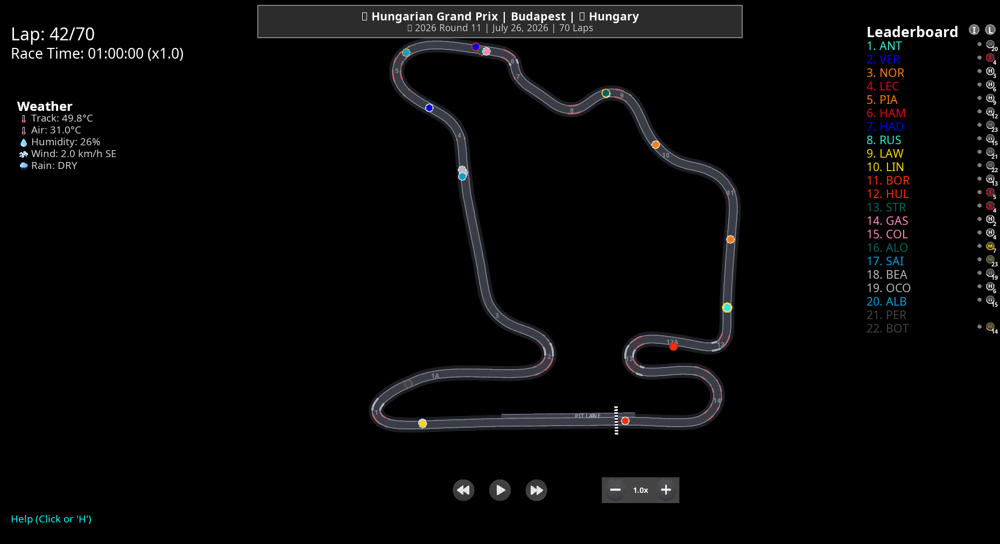

# Live Mode 🔴

Watch a Formula 1 session as it happens, in the same replay window you already
use for finished races. Cars move on the circuit in real time, the leaderboard
follows the official running order, and you can rewind into what has already
happened and jump back to live.



## Quick start

```bash
# Watch whatever session is running right now
python main.py --live
```

Or click the red **WATCH LIVE** banner at the top of the session selection
window. It tells you what is on and counts down to the next session when
nothing is running.

If no session is live, the command tells you what is next:

```
No session is running right now. Next up: Dutch Grand Prix - Practice 1
in 25h 48m (2026-08-21 10:30 UTC).
```

## Controls

Live mode adds one key to the normal replay controls:

| Key | Action |
|-----|--------|
| **G** | Go live — jump back to the newest data |

Pausing, rewinding, fast-forwarding, changing speed or dragging the progress
bar all drop you out of live and into the buffered replay of the session so
far. The badge in the top right shows which mode you are in:

- `● LIVE` — following the session as it happens
- `◀ -42s` — watching 42 seconds behind; press **G** to catch up

Everything else works exactly as it does for a finished race: the leaderboard,
tyre compounds, weather, safety car, driver telemetry, the insights menu and
the telemetry stream on `localhost:9999`.

## Where the data comes from

F1 publishes live timing through two channels, and this app can use both.

| Source | Latency | Needs an account | Notes |
|--------|---------|------------------|-------|
| **SignalR** (`wss://livetiming.formula1.com/signalrcore`) | ~0–2 s | Only for car positions and telemetry | The same feed the official timing app uses. |
| **Static archive** (`livetiming.formula1.com/static/…`) | ~5–10 s | No | Feed files that grow during the session; fetched with HTTP range requests so each poll costs a few kilobytes. |

The default `auto` source connects to SignalR for the lowest latency. Timing,
track status, weather and race control arrive for everyone. Car positions and
telemetry (`Position.z` and `CarData.z`) may require a Formula 1 account, so if
they have not arrived after 20 seconds the app quietly brings up the public
static feed alongside it and carries on. You will see:

```
[live] no car positions on the SignalR feed; adding the public timing
archive for positions and telemetry
```

### Signing in (optional, lowest latency)

Car positions come through the SignalR feed a few seconds earlier if you sign
in with a Formula 1 account that has an F1 TV Access/Pro/Premium subscription.
```bash
python main.py --live-auth      # show whether a token is stored
python main.py --live-login     # sign in through the browser
python main.py --live-logout    # forget the stored token
```

`--live-login` prints a URL to open; signing in there hands the token back.
The token is stored by FastF1, not by this project. To never attempt to use it,
pass `--live-no-auth` or set `F1_LIVE_NO_AUTH=1`.

## Options

| Flag | Default | Description |
|------|---------|-------------|
| `--live` | — | Watch the session running right now |
| `--live-source auto\|signalr\|static\|simulated` | `auto` | Which feed to use |
| `--live-delay <seconds>` | `2` (SignalR) / `8` (static) | How far behind the newest data to render |
| `--live-path <feed path>` | discovered | Attach to a specific session feed |
| `--live-record <file>` | — | Save the raw feed for later analysis |
| `--live-no-auth` | off | Never use a Formula 1 account token |
| `--live-auth` / `--live-login` / `--live-logout` | — | Manage the optional Formula 1 sign-in |
| `--live-speed <multiplier>` | `1.0` | Playback speed for the simulated source |
| `--live-offset <seconds>` | `0` | Where to start in a simulated replay |
| `--no-hud` | off | Hide the HUD |
| `--refresh-data` | off | Rebuild the cached track layout |

`F1_LIVE_DELAY` and `F1_LIVE_NO_AUTH` set the delay and anonymous mode from the
environment.

### About the delay

The render clock deliberately trails the newest received sample. That lets
every frame be interpolated *between* two received positions rather than
extrapolated past the last one, which is the difference between smooth cars and
stuttering ones. Two seconds is a good balance on the SignalR feed; lower it if
you want to be as close to the timing screens as possible and can live with
occasional stutter:

```bash
python main.py --live --live-delay 0.5
```

Even at the default, the app is usually **ahead of the television broadcast**,
which carries its own several-second delay.

## Trying it without a live session

The simulated source replays a finished session at wall-clock speed through the
exact same pipeline, which is the easiest way to check your setup before a race
weekend:

```bash
python main.py --live --live-source simulated \
  --live-path "2026/2026-07-26_Hungarian_Grand_Prix/2026-07-26_Race/" \
  --live-speed 1 --live-offset 4200
```

`--live-offset` skips ahead in the recording (4200 seconds lands roughly 20
minutes into the race). The archive is downloaded once and cached under
`computed_data/live_archive/`.

Feed paths look like `<year>/<race date>_<Event_Name>/<session date>_<Session>/`
and are listed at <https://livetiming.formula1.com/static/2026/Index.json>.

## How it works

```
F1 live timing feeds
        │
   ┌────┴─────┐  SignalRSource / StaticStreamSource / SimulatedLiveSource
   │  sources │  decode .z payloads, hand over LiveMessage objects
   └────┬─────┘
        │
  LiveSessionState   driver list, timing, stints, track status, weather,
        │            plus per-driver position and telemetry history
        │
  LiveFrameBuilder   interpolates each car at the render time and emits a
        │            frame identical in shape to an offline replay frame
        │
  LiveFrameBuffer    append-only, memory-bounded, absolute indices
        │
  F1RaceReplayWindow the existing replay window, following the newest frame
```

Frames are produced 25 times per second on the session clock, the same rate the
offline pipeline uses, so every existing feature keeps working unchanged.

### The track layout

Live position data is just coordinates — drawing the circuit needs a reference
lap. Live mode takes one from an earlier session at the same circuit, preferring
this weekend's qualifying and falling back through the practice sessions and
then previous seasons. The result is cached in
`computed_data/track_reference/`, so the first live session at a circuit takes
a minute longer to start and later ones are instant.

If the app has never seen a circuit before and cannot download any past session
for it, it will say so rather than drawing cars on an empty screen.

## Data quality

The live feeds are noisy, and the app cleans them up:

- **Position glitches.** Roughly one sample in a thousand places a car hundreds
  of metres from where it actually is. Anything implying more than 400 km/h is
  rejected unless several consecutive readings agree with each other, which
  distinguishes a glitch from a genuine relocation such as a car being recovered
  to the pits.
- **Timestamp jitter.** Samples nominally arrive at about 4 Hz but the spacing
  varies. Samples closer together than 50 ms are dropped, because dividing by a
  near-zero interval turns jitter into a teleport.
- **Pedal dropouts.** The feed publishes `104` for throttle and brake when a
  car's pedal data is not being transmitted. Those are treated as "no data" and
  the last known value is carried forward instead of flickering to zero.

Cars can still make a visible jump occasionally, usually around the pit lane.
That is the feed, not the app — the official timing map does the same.

## Known limitations

- **No DRS in 2026.** The DRS channel was removed from the feed for the 2026
  regulations, so `drs` is always `0` in live frames and no DRS zones are drawn.
- **Tyre degradation modelling is off** in live mode; it needs a completed
  session's lap data.
- **Lap times** come from the timing feed rather than from the replay's own
  lap detection, so the lap-time chart fills in as the session runs.
- **Practice and qualifying** work, but they are shown with the race layout
  (cars on track and a running order), not the qualifying-specific screens.

## Troubleshooting

**"No session is running right now."**
The app checks F1's own session index and the FastF1 calendar. Sessions become
joinable 45 minutes before their scheduled start.

**The window says "waiting for cars".**
Timing has connected but no position data has arrived yet. This is normal
before cars go out. The static feed is added automatically after 20 seconds if
SignalR is not delivering positions.

**Cars are in the wrong place.**
The cached track reference may be from a circuit layout that has since changed.
Re-run with `--refresh-data`.

**Recording a session for later.**

```bash
python main.py --live --live-record hungary_2026.txt
```

The file is compatible with FastF1's recorder, so it can be replayed afterwards
with `fastf1.livetiming.data.LiveTimingData`.
